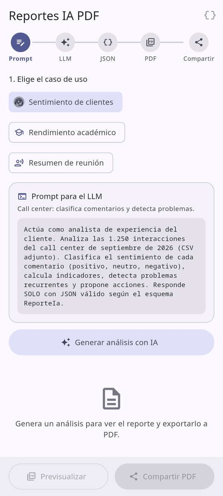
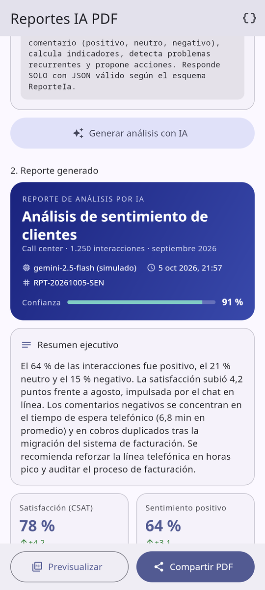
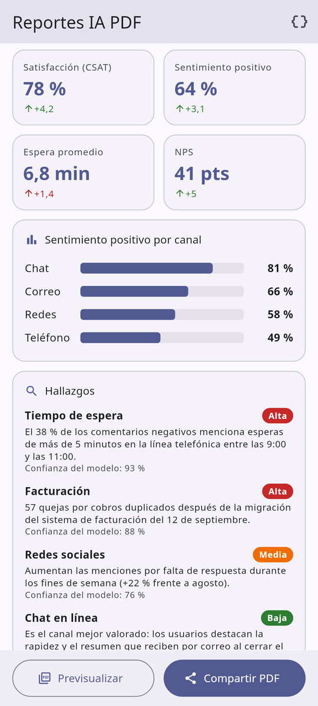
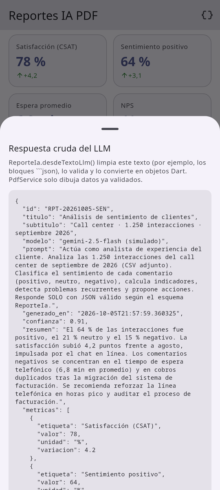
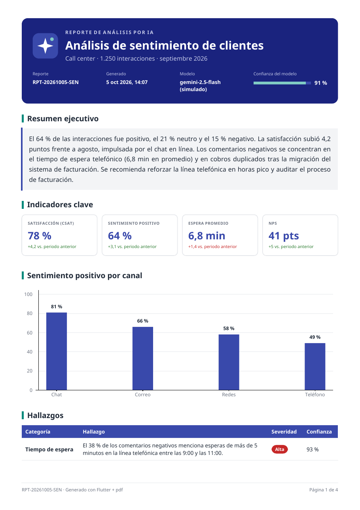
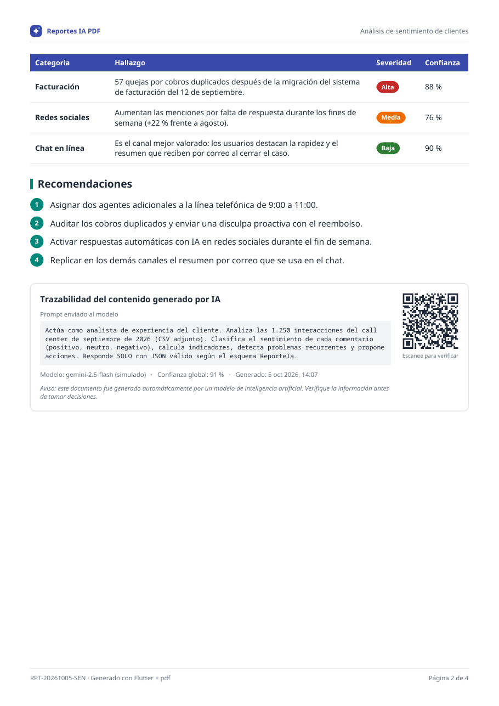
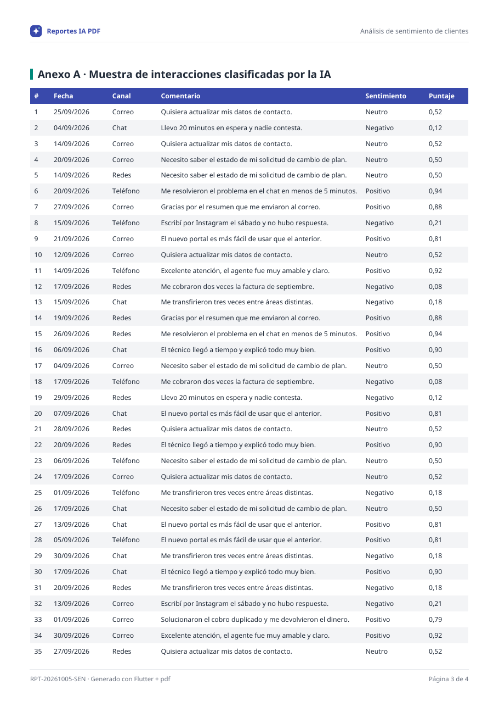

# Reportes PDF con IA en Flutter

**Tema 13 · Reportes PDF y Compartir.** Cómo generar documentos PDF nativos en el teléfono y entregarlos con el menú Compartir del sistema. El caso de uso es un **reporte de análisis generado por IA**.

Paquetes: [`pdf`](https://pub.dev/packages/pdf) · [`printing`](https://pub.dev/packages/printing) · [`share_plus`](https://pub.dev/packages/share_plus) · [`path_provider`](https://pub.dev/packages/path_provider)

> Desarrollo de Aplicaciones para Dispositivos Móviles · Universidad de Nariño · 2026-2

| Inicio | Reporte de la IA | Hallazgos | JSON del LLM |
|:---:|:---:|:---:|:---:|
|  |  |  |  |

| PDF · página 1 | PDF · página 2 | PDF · anexo multipágina |
|:---:|:---:|:---:|
|  |  |  |

📄 PDF de ejemplo generado por la app: [`docs/ejemplo_reporte_sentimiento.pdf`](docs/ejemplo_reporte_sentimiento.pdf)

🎤 Presentación de la exposición (PowerPoint editable): [`Presentacion_Tema13_Reportes_PDF.pptx`](Presentacion_Tema13_Reportes_PDF.pptx)

---

## ¿Qué demuestra este proyecto?

- **PDF declarativo con `pdf/widgets.dart`**: portada, KPIs, gráfico de barras, tablas, QR y numeración "Página X de Y".
- **Paginación automática con `MultiPage`**: el encabezado y el pie se repiten en cada hoja, y las tablas largas se parten repitiendo su fila de títulos.
- **Fuentes TTF embebidas** (Noto Sans): las tildes, la ñ y los signos ¿ ¡ se ven bien en cualquier visor.
- **Generación en un isolate** (`Isolate.run`) para que la UI no se congele.
- **Vista previa nativa** con `PdfPreview` (paquete `printing`): cambio A4/Carta, imprimir, *Guardar como PDF* y guardar en el dispositivo.
- **Menú Compartir nativo** con `SharePlus.instance.share()`: `Intent.ACTION_SEND` en Android y `UIActivityViewController` en iOS.
- **Integración con IA**: prompt → respuesta JSON del LLM → validación → modelo de datos → PDF. Incluye trazabilidad (prompt, modelo, confianza y aviso de contenido generado por IA).
- **3 casos reales**: sentimiento de clientes (call center), rendimiento académico (StudyBuddy IA) y resumen de una reunión transcrita.
- **Pruebas**: 28 tests (parser del LLM, generador PDF, compartir con plataforma simulada, archivos y flujo de UI).

## Arquitectura

```
┌──────────────┐   prompt    ┌──────────────┐  texto JSON  ┌──────────────────────┐
│  UI Flutter  │ ──────────> │  IaService   │ ───────────> │ ReporteIa            │
│ (Material 3) │             │ (LLM / mock) │              │ .desdeTextoLlm()     │
└──────┬───────┘             └──────────────┘              │ limpia + valida      │
       │                                                   └──────────┬───────────┘
       │  ReporteIa (modelo de datos, Dart puro)                      │
       ▼                                                              ▼
┌──────────────────────────────┐  Uint8List  ┌───────────────────┐  File   ┌──────────────────────┐
│ PdfService                   │ ──────────> │ ArchivosService   │ ──────> │ ShareService         │
│  Isolate.run → MultiPage     │             │ getTemporaryDir.  │         │ SharePlus.instance   │
│  ComponentesPdf (pw.Widgets) │             │ (path_provider)   │         │   .share(ShareParams)│
└──────────────┬───────────────┘             └───────────────────┘         └──────────┬───────────┘
               │ bytes                                                                │ MethodChannel
               ▼                                                                      ▼
┌──────────────────────────────┐                             ┌──────────────────────────────────────┐
│ PdfPreview (printing)        │                             │ Android: FileProvider (content://)   │
│ PdfRenderer / CoreGraphics   │                             │   + Intent.ACTION_SEND + Chooser     │
│ Imprimir · Guardar · A4/Carta│                             │ iOS: UIActivityViewController        │
└──────────────────────────────┘                             └──────────────────────────────────────┘
```

Cada capa tiene una sola responsabilidad. `PdfService` recibe datos y devuelve bytes: no sabe de pantallas, archivos ni de compartir. Por eso se puede copiar a otro proyecto.

## Requisitos previos

| Herramienta | Versión |
|---|---|
| Flutter | **≥ 3.41** (probado con 3.47.5 stable) |
| Dart | ≥ 3.12 (probado con 3.13.4) |
| Android SDK | API 36 (compileSdk); el emulador puede ser API 24+ |
| JDK | 17 o superior |
| iOS (opcional) | macOS + Xcode 16+ y CocoaPods |

> **Recomendado para la demo:** un emulador con imagen **Google Play** (trae Gmail, Drive y Mensajes), así el menú Compartir muestra apps reales.

Comprueba tu entorno:

```bash
flutter doctor
```

## Ejecución paso a paso

```bash
# 1. Clonar el repositorio
git clone https://github.com/Sebas366/reportes_pdf.git
cd reportes_pdf

# 2. Descargar dependencias
flutter pub get

# 3. Abrir un emulador (o conectar un teléfono con depuración USB)
flutter emulators                        # lista los emuladores disponibles
flutter emulators --launch <id_emulador>

# 4. Ejecutar
flutter run

# 5. (Opcional) Pruebas y APK
flutter test
flutter build apk --release
```

**¿No tienes emulador?** Créalo desde Android Studio (*Device Manager → Create device → Pixel 8 → imagen "Google Play" API 35*) o por terminal:

```bash
sdkmanager "system-images;android-35;google_apis_playstore;x86_64"
avdmanager create avd -n Pixel_Demo -k "system-images;android-35;google_apis_playstore;x86_64" -d pixel_8
flutter emulators --launch Pixel_Demo
```

> La primera compilación de Android tarda bastante, porque Gradle descarga el NDK, CMake y la plataforma 36. Las siguientes toman segundos.

## Cómo se usa la app

1. Elige un caso de uso (**Sentimiento de clientes**, **Rendimiento académico** o **Resumen de reunión**).
2. Pulsa **Generar análisis con IA**. El servicio simulado responde en ~1,2 s con JSON, como lo haría un LLM real.
3. Revisa el reporte en pantalla. El icono `{ }` muestra la respuesta cruda del modelo.
4. **Previsualizar**: vista previa nativa. Desde ahí puedes:
   - 🖨 **Imprimir**, que también ofrece *Guardar como PDF* en el almacenamiento público, sin permisos.
   - 💾 **Guardar** una copia en los documentos de la app (en iOS se ve en *Archivos*).
   - 🔗 **Compartir**, o cambiar entre **A4 y Carta**.
5. **Compartir PDF**: genera el archivo y abre el menú nativo (Gmail, WhatsApp, Drive…).
6. El interruptor **Incluir anexo detallado** agrega una tabla de 16–42 filas que ocupa varias páginas.

## Dependencias

| Paquete | Versión | ¿Para qué? | ¿Código nativo? |
|---|---|---|---|
| `pdf` | ^3.13.1 | Motor de layout: construye el documento con widgets y lo serializa a bytes. | No (100 % Dart) |
| `printing` | ^5.15.1 | `PdfPreview`, impresión, *Guardar como PDF*, rasterizado de páginas. | Sí (PdfRenderer + PrintManager / Core Graphics + UIPrintInteractionController) |
| `share_plus` | ^13.3.1 | Menú Compartir del sistema y resultado (`ShareResult`). | Sí (Intent / UIActivityViewController) |
| `path_provider` | ^2.1.6 | Rutas del directorio temporal y de documentos. | Sí |
| `share_plus_platform_interface` | ^7.2.0 (dev) | Simular el menú Compartir en las pruebas. | No |

> ⚠️ **Cambio de API en share_plus:** desde la v11, `Share.share()` y `Share.shareXFiles()` están **deprecados**. La API actual es:
>
> ```dart
> await SharePlus.instance.share(ShareParams(files: [XFile(ruta)], text: '...'));
> ```

## Estructura del proyecto

```
lib/
├── main.dart                       # Arranque + limpieza de PDFs temporales viejos
├── models/
│   ├── escenario.dart              # Casos de uso y sus prompts
│   └── reporte_ia.dart             # Contrato LLM → PDF + validación (desdeTextoLlm)
├── data/
│   └── respuestas_simuladas.dart   # JSON de ejemplo "devuelto por el LLM"
├── services/
│   ├── ia_service.dart             # Interfaz IaService + implementación simulada
│   ├── pdf/
│   │   ├── pdf_service.dart        # Isolate, fuentes, MultiPage → Uint8List
│   │   └── pdf_componentes.dart    # Portada, KPIs, gráfico, tablas, QR, pie
│   ├── archivos_service.dart       # Temporal / documentos (path_provider)
│   └── share_service.dart          # Archivo temporal → SharePlus
├── screens/
│   ├── inicio_screen.dart          # Flujo principal y manejo de errores
│   └── vista_previa_screen.dart    # PdfPreview + guardar / compartir
├── widgets/                        # Indicador de flujo, prompt, reporte, hoja JSON
├── theme/                          # Paleta compartida UI + PDF, tema Material 3
└── utils/formato.dart              # Números y fechas en español sin intl
assets/fonts/                       # Noto Sans (OFL) — usadas en UI y PDF
test/                               # 28 pruebas
docs/                               # Capturas y PDF de ejemplo
```

## Configuración nativa

### Android — `android/app/src/main/AndroidManifest.xml`

- **No se piden permisos de almacenamiento.** El PDF se escribe en directorios privados de la app. `share_plus` lo copia a `cache/share_plus` y lo entrega como URI `content://` a través de su propio `FileProvider` (se fusiona solo desde el manifest del plugin), con permiso de lectura **temporal** para la app destino.
- **`<queries>` (Android 11+, visibilidad de paquetes):** `share_plus` llama a `queryIntentActivities()` para conceder la lectura de la URI a cada app candidata. Sin estas declaraciones, la lista llega filtrada.

```xml
<queries>
    <intent>
        <action android:name="android.intent.action.SEND"/>
        <data android:mimeType="application/pdf"/>
    </intent>
</queries>
```

- **`INTERNET`** está comentado. Actívalo cuando conectes un LLM real: en *debug* Flutter lo agrega solo, pero en *release* no.

### iOS — `ios/Runner/Info.plist`

- Compartir archivos propios **no necesita llaves**.
- `UIFileSharingEnabled` + `LSSupportsOpeningDocumentsInPlace`: los PDF guardados aparecen en la app **Archivos**.
- `NSPhotoLibraryAddUsageDescription`: evita que la app se cierre si el usuario elige *Guardar imagen* en el menú Compartir.
- En **iPad**, el menú es un *popover* que necesita un punto de anclaje: se envía `sharePositionOrigin` con el rectángulo del botón.

## Reutilizar el generador en tu proyecto

### Opción A — Mínima (copiar y pegar)

```bash
flutter pub add pdf share_plus path_provider
```

Copia una fuente TTF a `assets/fonts/` y decláralo en `pubspec.yaml`. Después:

```dart
import 'dart:io';

import 'package:flutter/services.dart' show rootBundle;
import 'package:path_provider/path_provider.dart';
import 'package:pdf/widgets.dart' as pw;
import 'package:share_plus/share_plus.dart';

/// Genera un PDF con el texto de la IA y abre el menú Compartir.
Future<ShareResult> exportarResumenIa(String titulo, String textoIa) async {
  // 1. Fuente Unicode (tildes, ñ).
  final fuente = pw.Font.ttf(await rootBundle.load('assets/fonts/NotoSans-Regular.ttf'));

  // 2. Documento: MultiPage pagina solo si el texto es largo.
  final doc = pw.Document(title: titulo);
  doc.addPage(
    pw.MultiPage(
      theme: pw.ThemeData.withFont(base: fuente),
      build: (context) => [
        pw.Header(level: 0, text: titulo),
        pw.Paragraph(text: textoIa),
      ],
      footer: (context) => pw.Align(
        alignment: pw.Alignment.centerRight,
        child: pw.Text('Página ${context.pageNumber} de ${context.pagesCount}'),
      ),
    ),
  );

  // 3. Bytes → archivo temporal → menú nativo.
  final archivo = File('${(await getTemporaryDirectory()).path}/resumen_ia.pdf');
  await archivo.writeAsBytes(await doc.save(), flush: true);
  return SharePlus.instance.share(
    ShareParams(files: [XFile(archivo.path, mimeType: 'application/pdf')], subject: titulo),
  );
}
```

### Opción B — Usar los servicios de este repo

1. Copia `lib/services/` (`pdf/`, `archivos_service.dart`, `share_service.dart`), `lib/models/reporte_ia.dart`, `lib/theme/marca.dart` y `lib/utils/formato.dart`.
2. Copia `assets/fonts/` y la sección `fonts:` del `pubspec.yaml`.
3. Cambia los colores y el nombre en `Marca`: el PDF y la UI toman la paleta de ahí.
4. Úsalos:

```dart
final reporte = ReporteIa.desdeTextoLlm(textoDelModelo);           // valida el JSON del LLM
final bytes = await const PdfService().generar(reporte);            // Uint8List del PDF
await ShareService().compartirPdf(bytes: bytes, nombreArchivo: reporte.nombreArchivo);
```

5. ¿Otro diseño? Edita o agrega métodos en `ComponentesPdf` y ordénalos en la lista `build:` de `PdfService.construirDocumento`.

## Conectar un LLM real

La UI solo conoce la interfaz `IaService`. Para usar Gemini, OpenAI o un modelo local, crea otra implementación y pásala a `ReportesApp(iaService: ...)`. El ejemplo de referencia con la API REST de Gemini **no viene incluido** en el proyecto: requiere `flutter pub add http` y verificar el nombre vigente del modelo.

```dart
class IaServiceGemini implements IaService {
  IaServiceGemini({required this.apiKey, this.modelo = 'gemini-2.5-flash'});

  final String apiKey;
  final String modelo;

  @override
  Future<RespuestaIa> analizar(Escenario escenario) async {
    final respuesta = await http
        .post(
          Uri.https('generativelanguage.googleapis.com', '/v1beta/models/$modelo:generateContent'),
          headers: {'Content-Type': 'application/json', 'x-goog-api-key': apiKey},
          body: jsonEncode({
            'contents': [
              {'parts': [{'text': '${escenario.prompt}\nEsquema JSON: $esquemaReporteIa'}]},
            ],
            // Salida estructurada: el modelo responde JSON, no prosa.
            'generationConfig': {'responseMimeType': 'application/json'},
          }),
        )
        .timeout(const Duration(seconds: 60));

    if (respuesta.statusCode != 200) {
      throw HttpException('El modelo respondió ${respuesta.statusCode}');
    }
    final texto = jsonDecode(respuesta.body)['candidates'][0]['content']['parts'][0]['text'] as String;
    return RespuestaIa(textoCrudo: texto, reporte: ReporteIa.desdeTextoLlm(texto));
  }
}
```

- `esquemaReporteIa` puede ser el `toJson()` de un reporte de ejemplo (ver `respuestas_simuladas.dart`).
- Para probar: `flutter run --dart-define=GEMINI_API_KEY=...` y `const String.fromEnvironment('GEMINI_API_KEY')`.
- **En producción la API key no va en la app** (se puede extraer del APK). Llama al modelo desde tu backend y que la app reciba solo el JSON.

## Pruebas

```bash
flutter test                                   # 28 pruebas
PDF_SALIDA=/tmp flutter test test/pdf_service_test.dart   # además guarda los PDF en /tmp
```

| Archivo | Qué verifica |
|---|---|
| `reporte_ia_test.dart` | Parser del LLM: bloques ```json, JSON inválido, campos faltantes, confianza 92→0,92, números como texto, ida y vuelta toJson/fromJson, formato es-CO. |
| `pdf_service_test.dart` | Genera PDFs completos (`%PDF-`…`%%EOF`) para los 3 casos, con y sin anexo, en A4 y Carta; caché de fuentes. |
| `share_service_test.dart` | Escribe el temporal, comparte como `application/pdf` con asunto y texto, propaga `dismissed`; limpieza de temporales. |
| `widget_test.dart` | Flujo de UI en tamaño de teléfono: botones deshabilitados → generar → habilitados → hoja JSON. |

## Problemas comunes

| Síntoma | Causa | Solución |
|---|---|---|
| `MissingPluginException` | Se agregó un paquete con código nativo y solo se hizo *hot reload*. | Detén la app y vuelve a ejecutar `flutter run`. |
| Tildes o ñ salen como cuadros, o aparece *"Helvetica has no Unicode support"* | Se usan las fuentes estándar del PDF (solo Latin-1). | Embebe una TTF con `pw.ThemeData.withFont(...)`. |
| `Widget won't fit into the page` | Un `Column`/`Container` más alto que una página dentro de `MultiPage`. | Devuelve una **lista** de widgets o usa widgets que se parten (`Table`, `Text`, `Wrap`). |
| `PdfTooBigPageException: This widget created more than 20 pages` | En modo debug, `MultiPage` verifica que **un solo widget** (p. ej. una tabla enorme) no ocupe más de `maxPages` (20) páginas. | Sube `maxPages:` o divide los datos en varias tablas. |
| La app se cierra al compartir en iPad | Falta el punto de anclaje del popover. | Envía `sharePositionOrigin` (ver `inicio_screen.dart`). |
| *Shared file can not be located in 'cache/share_plus'* | Guardaste el PDF dentro de la carpeta interna de share_plus. | Usa otra subcarpeta (aquí: `cache/reportes_compartidos`). |
| `version solving failed` | `printing 5.15` exige Flutter ≥ 3.41. | `flutter upgrade`, o fija versiones anteriores de los paquetes. |
| La primera compilación tarda > 10 min | Gradle descarga NDK, CMake y la plataforma Android. | Compila una vez **antes** de la exposición. |

## Créditos y licencias

- Fuentes **Noto Sans** y **Noto Sans Mono**: SIL Open Font License 1.1 (`assets/fonts/OFL.txt`).
- Paquetes `pdf` y `printing` de David PHAM-VAN (Apache 2.0) y `share_plus` de Flutter Community (BSD-3).
- Los datos de los reportes son **ficticios** y fueron creados para la demostración.
- Código del ejemplo: licencia MIT (ver `LICENSE`).
